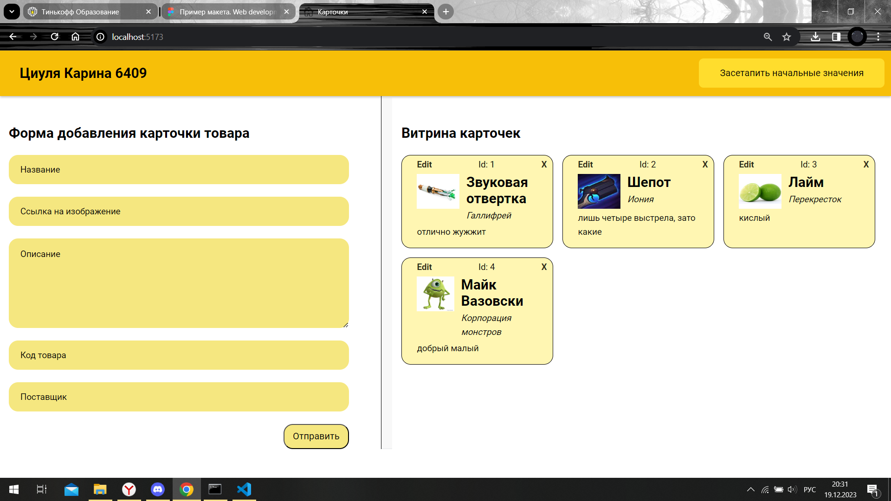

# Empty vite template

Админка карточек (товаров):

Составляющие:
 - форма для создания и добавления и редактирования карточек (слева);
 - витрина, хранящая все имеющиеся карточки;
 - кнопка для создания начальных карточек;
Каждая карточка содержит кнопки для удаления (крестик) и редактирования (edit).
Для запуска (должны быть установлены git и nodejs):
- install node.js v16>(npm v7.x>) (https://nodejs.org/en/download/)
- install git(https://git-scm.com/downloads)
- npm install -g json-server
- json-server --watch database.json
- `npm i` - установка зависимостей таких как less
-`npm run dev` - запускается dev-server, в терминале будет указан адресс и порт на котором запустился сервер
- после перехода по указанному серверу и порту можно видеть работающий сайт (и при изменении файлов сайт будет автоматически обновляться)